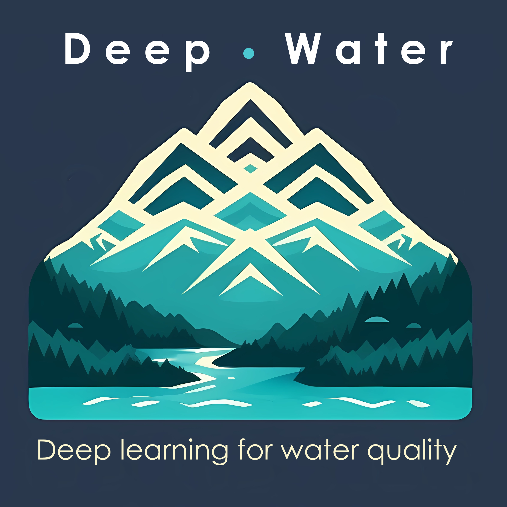

# *DeepWater*: deep learning for water quality 

The ***DeepWater*** is a flexible, scalable, and explainable deep learning (DL) model to predict riverine water quality. The model is designed to predict spatio-temporal dynamics of water quality at the large scale (e.g., hundreds of rivers) for decades. 

By leveraging the power of big data and deep learning, the ***DeepWater*** aims to improve our ability to better model and understand water quality for decadal trends, seasonal patterns, and daily variations under diverse and changing hydro-climate conditions. 

The model is developed based on *HydroDL* (a hydrology DL model) to focus on water quality with expanding capacities of 
* handling sparse data and large data gaps
* flexible splitting schemes (e.g., based on the data distribution of each basin)
* multi-task prediction (e.g., concentration and flux of multiple solutes)
* model interpretability for input importance. 

## Example

## Reference
