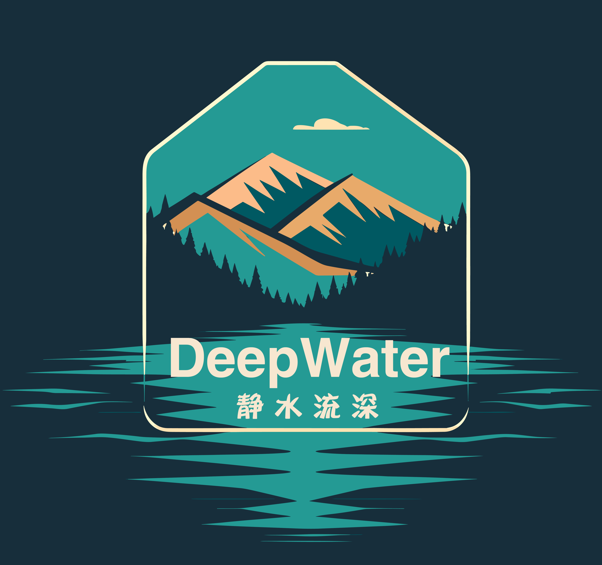

# *DeepWater* : deep learning for water quality 

The ***DeepWater*** is a flexible, scalable, and explainable deep learning (DL) model to predict riverine water quality. The model is designed to predict spatio-temporal dynamics of water quality at the large scale (e.g., hundreds of rivers) for decades. 

By leveraging the power of big data and deep learning, the ***DeepWater*** aims to improve our ability to better model and understand water quality for decadal trends, seasonal patterns, and daily variations under diverse and changing hydro-climate conditions. 

## Model features
The model is developed based on *HydroDL* (a hydrology DL model) to focus on water quality with expanding capacities: 
* handling sparse water quality data and large data gaps
* flexible splitting scheme (e.g., based on the data distribution of each basin)
* multi-task prediction (e.g., concentration and flux of multiple solutes)
* model interpretability for input importance

## Model philosophy
***DeepWater*** (静水流深)，正如古谚语所描述的一样，利用深度学习技术挖掘水质数据中潜藏的深层信息，深入理解水质变化的本质和规律。

Note: the Chinese phrase "静水流深" translates to "still waters run deep", conveying an idea that the elegant DL model, with hidden depth and profound intelligence, could see through the calm and quiet surface water to reveal underlying dynamics and fundamental principles.

## Example

## Reference
